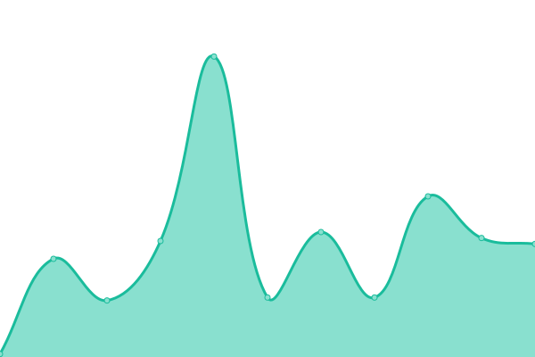

# [📈 Live Status](https://iwhp.github.io/upptime): <!--live status--> **🟧 Partial outage**

This repository contains the open-source uptime monitor and status page for [Harry Pfleger](http://www.infoware.li), powered by [Upptime](https://github.com/upptime/upptime).

With [Upptime](https://upptime.js.org), you can get your own unlimited and free uptime monitor and status page, powered entirely by a GitHub repository. We use [Issues](https://github.com/iwhp/upptime/issues) as incident reports, [Actions](https://github.com/iwhp/upptime/actions) as uptime monitors, and [Pages](https://iwhp.github.io/upptime) for the status page.

<!--start: status pages-->
<!-- This summary is generated by Upptime (https://github.com/upptime/upptime) -->
<!-- Do not edit this manually, your changes will be overwritten -->

| URL                                              | Status  | History                                                                                             | Response Time                                                                          | Uptime                                                                                                                                                                                                                    |
| ------------------------------------------------ | ------- | --------------------------------------------------------------------------------------------------- | -------------------------------------------------------------------------------------- | ------------------------------------------------------------------------------------------------------------------------------------------------------------------------------------------------------------------------- |
| [VIEWER.LI](https://www.viewer.li)               | 🟩 Up   | [viewer-li.yml](https://github.com/iwhp/upptime/commits/master/history/viewer-li.yml)               |  618ms         |               |
| [BALLERISTO.COM](https://www.balleristo.com)     | 🟩 Up   | [balleristo-com.yml](https://github.com/iwhp/upptime/commits/master/history/balleristo-com.yml)     |  930ms    |     |
| [NATURCOIFFEUR.EU](https://www.naturcoiffeur.eu) | 🟩 Up   | [naturcoiffeur-eu.yml](https://github.com/iwhp/upptime/commits/master/history/naturcoiffeur-eu.yml) |  6716ms |  |
| Secret Site                                      | 🟥 Down | [secret-site.yml](https://github.com/iwhp/upptime/commits/master/history/secret-site.yml)           |  0ms         |            |

<!--end: status pages-->

[**Visit our status website →**](https://iwhp.github.io/upptime)

## 📄 License

- Powered by: [Upptime](https://github.com/upptime/upptime)
- Code: [MIT](./LICENSE) © [Harry Pfleger](http://www.infoware.li)
- Data in the `./history` directory: [Open Database License](https://opendatacommons.org/licenses/odbl/1-0/)
