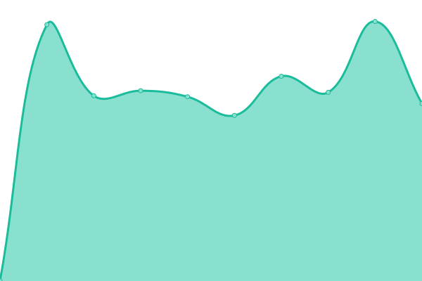

# [📈 Live Status](https://iwhp.github.io/upptime): <!--live status--> **🟩 All systems operational**

This repository contains the open-source uptime monitor and status page for [Harry Pfleger](http://www.infoware.li), powered by [Upptime](https://github.com/upptime/upptime).

With [Upptime](https://upptime.js.org), you can get your own unlimited and free uptime monitor and status page, powered entirely by a GitHub repository. We use [Issues](https://github.com/iwhp/upptime/issues) as incident reports, [Actions](https://github.com/iwhp/upptime/actions) as uptime monitors, and [Pages](https://iwhp.github.io/upptime) for the status page.

<!--start: status pages-->
<!-- This summary is generated by Upptime (https://github.com/upptime/upptime) -->
<!-- Do not edit this manually, your changes will be overwritten -->
<!-- prettier-ignore -->
| URL | Status | History | Response Time | Uptime |
| --- | ------ | ------- | ------------- | ------ |
|  [VIEWER.LI](https://www.viewer.li) | 🟩 Up | [viewer-li.yml](https://github.com/iwhp/upptime/commits/HEAD/history/viewer-li.yml) | 

 699ms
     
 | 

<a href="https://iwhp.github.io/upptime/history/viewer-li">100.00%</a>
    

|  [BALLERISTO.COM](https://www.balleristo.com) | 🟩 Up | [balleristo-com.yml](https://github.com/iwhp/upptime/commits/HEAD/history/balleristo-com.yml) | 

 625ms
     
 | 

<a href="https://iwhp.github.io/upptime/history/balleristo-com">100.00%</a>
    

|  [NATURCOIFFEUR.EU](https://www.naturcoiffeur.eu) | 🟩 Up | [naturcoiffeur-eu.yml](https://github.com/iwhp/upptime/commits/HEAD/history/naturcoiffeur-eu.yml) | 

 1313ms
     
 | 

<a href="https://iwhp.github.io/upptime/history/naturcoiffeur-eu">100.00%</a>
    

|  [ARDIMEDIA.COM](https://www.ardimedia.com) | 🟩 Up | [ardimedia-com.yml](https://github.com/iwhp/upptime/commits/HEAD/history/ardimedia-com.yml) | 

 670ms
     
 | 

<a href="https://iwhp.github.io/upptime/history/ardimedia-com">100.00%</a>
    

|  [BVD.LI](https://www.bvd.li) | 🟩 Up | [bvd-li.yml](https://github.com/iwhp/upptime/commits/HEAD/history/bvd-li.yml) | 

 1134ms
     
 | 

<a href="https://iwhp.github.io/upptime/history/bvd-li">100.00%</a>
    

<!--end: status pages-->

[**Visit our status website →**](https://iwhp.github.io/upptime)

## 📄 License

- Powered by: [Upptime](https://github.com/upptime/upptime)
- Code: [MIT](./LICENSE) © [Harry Pfleger](http://www.infoware.li)
- Data in the `./history` directory: [Open Database License](https://opendatacommons.org/licenses/odbl/1-0/)
